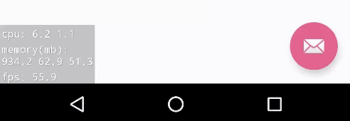
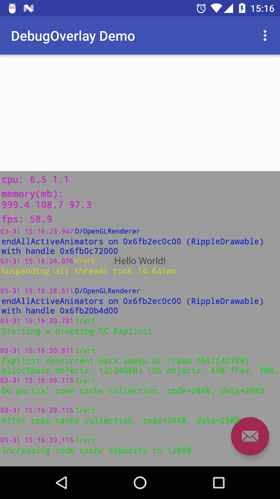
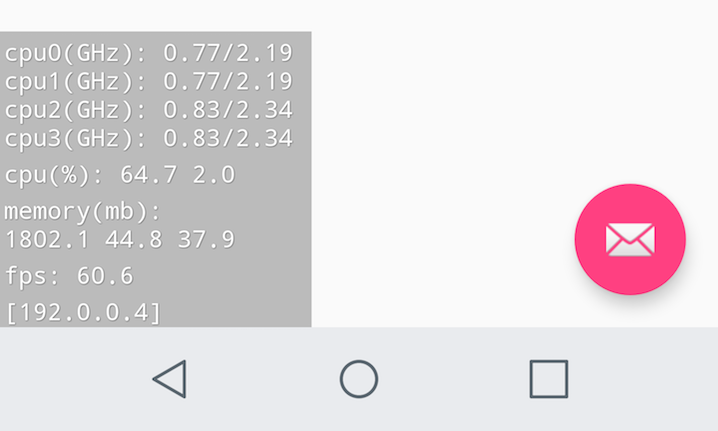

DebugOverlay-Android
===========
[](https://android-arsenal.com/details/1/5516)
[](https://maven-badges.herokuapp.com/maven-central/com.ms-square/debugoverlay)
[](https://android-arsenal.com/api?level=16)
[](https://www.apache.org/licenses/LICENSE-2.0)

**DebugOverlay** is an Android library that allows developers to easily add custom overlay window/view for debugging purpose.

You can use it to show some performance related metrics such as cpu, memory, and fps. Or you can show logcat messages within your app for light debugging.

This library is fully customizable in terms of what you can show on the overlay. If you want to show something other than what's being provided, please go ahead and create your own overlay module!



Requirements
-------------
API Level 16 (Android 4.1) and above.

Setup
------
The library is pushed to Maven Central as an AAR,
so you just need to add the followings to your ***build.gradle*** file:

```groovy
dependencies {
  debugCompile 'com.ms-square:debugoverlay:1.1.3'
  releaseCompile 'com.ms-square:debugoverlay-no-op:1.1.3'
  testCompile 'com.ms-square:debugoverlay-no-op:1.1.3'
}
```

Please note that `com.ms-square:debugoverlay:1.1.3`  will add `android.permission.SYSTEM_ALERT_WINDOW`  to your app.
Threfore, you should avoid to use that dependency for your release build.

FYI, the following table describes the total number of method/field references in this library's release aar.
This data is acquired by using [Dexcount Gradle Plugin](https://github.com/KeepSafe/dexcount-gradle-plugin).

| library  | methods  | fields |
|:------------- |:-------------|:-------------|
|com.ms-square:debugoverlay:1.1.3|566|252|
|com.ms-square:debugoverlay-no-op:1.1.3|141|37|

Due to the extensibility of this library, no-op version unfortunately has more than a few methods.
If you want to eliminate such method count in your release build, consider having separate `Application` class only for your debug build which uses this library and just specify `debugCompile 'com.ms-square:debugoverlay:1.1.3'` in the dependencies section of build.gradle.

Usage
------

### Simple

In your `Application` class:

```java
public class ExampleApplication extends Application {

  @Override public void onCreate() {
    super.onCreate();
    DebugOverlay.with(this).install();
    // Normal app init code...
  }
}
```
It will show a debug overlay on system layer with the follwing three default modules just like the gif animation image displayed on this README.

- [CpuUsageModule](#cpuusagemodule) - will not be shown on Android O and above
- [MemInfoModule](#meminfomodule)
- [FpsModule](#fpsmodule)

### w/ Configurations



```java
new DebugOverlay.Builder(this)
        .modules(new CpuUsageModule(),
                new MemInfoModule(this),
                new FpsModule(),
                new LogcatModule())
        .position(Position.BOTTOM_START)
        .bgColor(Color.parseColor("#60000000"))
        .textColor(Color.MAGENTA)
        .textSize(14f)
        .textAlpha(.8f)
        .allowSystemLayer(true)
        .notification(true, MainActivity.class.getName())
        .build()
        .install();
```

* modules - [list or as variable length arguments]
>List of [OverlayModule][3]s to install

* position - [Position]
>Enum which specifies where to show the overlay. Default is `BOTTOM_START`.

* bgColor - [color]
>Color used for the background of the overlay. Default is `25% Black`.

* textColor - [color]
>Color used for text on the overlay. Default is `White`.

* textSize - [float]
>Size in `sp` used for text on the overlay. Default is `12sp`.

* textAlpha - [float]
>Alpha value used for text on the overlay.  Default is `1f`(fully opaque).

* allowSystemLayer - [boolean]
>If true, it adds the overlay window on Android's system window layer; in Android 7.1.1 and after, it will ask you for the overlay permission by taking you to the Android's settings screen when you first set up. If set to false, it  will automatically add the overlay on each application window. In most cases, you want to set this to `true`.
Default is `true`.

* notification - [boolean, string(optional)]
> *applicable only when allowSystemLayer is set to true*
>
> When set to true, it will show notification which allows you to show/hide the overlay window.
Default is `true`.
You can optionally supply string which must be your *activity's class name*.
It will be used to create PendingIntent to start the activity when the notification is tapped.

Provided Modules
------

#### CpuUsageModule

`default`
> Collects total and app cpu usage % by reading `/proc/stat` and `/proc/[myPid]/stat` respectively.

Note: CpuUsageModule will be no-op on Android O and above. Please see this [issue](https://github.com/Manabu-GT/DebugOverlay-Android/issues/11) for why.

#### MemInfoModule

`default`
> Collects device's current available memory, app's total PSS, and app's total private dirty info. Display unit is in `Megabyte`.

Refer to [Investigating Your RAM Usage](https://developer.android.com/studio/profile/investigate-ram.html#ViewingAllocations) for more info about PSS and private dirty RAM.

If low memory situation is detected by reading [lowMemory](https://developer.android.com/reference/android/app/ActivityManager.MemoryInfo.html#lowMemory), texts will be automatically displayed in `RED`.

#### FpsModule
`default`
> Measures FPS using [Choreographer](https://developer.android.com/reference/android/view/Choreographer.html).

#### LogcatModule
`optional`
> Collects logcat messages generated by your own app even on non-rooted devices.

#### CpuFreqModule
`optional`
> Collects each cpu core's current and max frequency by reading `/sys/devices/system/cpu/cpu[num]/cpufreq/scaling_cur_freq` and `/sys/devices/system/cpu/cpu[num]/cpufreq/cpuinfo_max_freq` respectively.

Note: CpuFreqModule will be no-op on Android O and above. Please see this [issue](https://github.com/Manabu-GT/DebugOverlay-Android/issues/11) for why.

Extension Modules (available separately)
------
#### TimberModule
`optional`
> An extension module which shows [Timber](https://github.com/JakeWharton/timber) logs for debugging.

For details, please check out [debugoverlay-ext-timber](https://github.com/Manabu-GT/DebugOverlay-Android/tree/develop/debugoverlay-ext-timber).

#### NetStatsModule
`optional`
> An extension module which shows the total network usage of the application. The stats include all network interfaces, and both TCP and UDP usage.

For details, please check out [debugoverlay-ext-netstats](https://github.com/Manabu-GT/DebugOverlay-Android/tree/develop/debugoverlay-ext-netstats).

Customization
------

### Filtering and coloring scheme of logcat view


#### Filtering

* [LogcatLineFilter][1]

implement the follwing IF method

```java
boolean shouldFilterOut(LogcatLine.Priority priority, @NonNull String tag)
```

#### Coloring

* [LogcatLineColorScheme][2]

implement the follwing IF method

```java
@ColorInt
int getTextColor(LogcatLine.Priority priority, @NonNull String tag)
```

Example:

```java
// filtering with LogcatLineFilter.SimpleLogcatLineFilter
// it filters out VERBOSE logs because DEBUG is minimum priority required
module = new LogcatModule(LogcatModule.DEFAULT_MAX_LINES,
                new LogcatLineFilter.SimpleLogcatLineFilter(LogcatLine.Priority.DEBUG));

// filtering with your own line filter
module = new LogcatModule(LogcatModule.DEFAULT_MAX_LINES, your_line_filter);

// coloring
module = new LogcatModule(LogcatModule.DEFAULT_MAX_LINES, your_color_scheme);

// both
module = new LogcatModule(LogcatModule.DEFAULT_MAX_LINES, your_line_filter, your_color_scheme);
```

### Using custom overlay view for provided modules

For any modules provided, you can pass your own implementation of [ViewModule][5] to use your custom view entirely to display the module data.

Example:

```java
// here, MyCpuViewModule must implement ViewModule interface
module = new CpuUsageModule(new MyCpuViewModule());
```

For **CpuUsage, CpuFreq, MemInfo, and Fps modules**, you can pass your own layout resource id as long as it contains TextView as a direct child with id set to `debugoverlay_overlay_text` which is already defined in this library. This allows you to style the TextView used within those modules very easily without fully implementing new [ViewModule][5] by yourself.

### Adding your own overlay module

As an example, let's add a new overlay module in the [sample project][7] which displays a list of IP addresses on your device. It can be quite useful if you have any server-type service running within your app.

For any type of module you want to add, you need to implement the following three types of components. (In most cases, the real work will be done in [DataModule][4].)

- [OverlayModule][3] - composed of DataModule and ViewModule
 - [DataModule][4] - responsible for getting data and notifying its observers
 - [ViewModule][5] - responsible for creating an overlay view and updating it with the latest data

Since this is a very simple overlay module which is going to display just one line of text using TextView, you can just use the provided [SimpleViewModule][6] as ViewModule.

DataModule is where the hardwork is done to get some meaningful data to show.
In this case, it will look like the following. For its full implementation, please take a look at [IPAddressDataModule][8].

```java
public class IPAddressDataModule extends BaseDataModule<String> {
    ....
    @Override
    public void start() {
        context.registerReceiver(receiver, new IntentFilter(ConnectivityManager.CONNECTIVITY_ACTION));
        ipAddresses = getV4IPAddressesString();
        notifyObservers();
    }

    @Override
    public void stop() {
        context.unregisterReceiver(receiver);
    }

    @Override
    protected String getLatestData() {
        return ipAddresses;
    }
    ....
}
```

We're almost done. Now just subclass [OverlayModule][3] and create `IPAddressModule` class  using the `IPAddressDataModule` as its data module.

```java
public class IPAddressModule extends OverlayModule<String> {

    public IPAddressModule(@NonNull Context context) {
        super(new IPAddressDataModule(context), new SimpleViewModule(R.layout.view_overlay_ip));
    }
}
```

Since a new custom module called `IPAddressModule` is created, let's actually show it on the overlay.

```java
// inside Application's onCreate()
new DebugOverlay.Builder(this)
        .modules(new CpuFreqModule(),
                 new CpuUsageModule(),
                 new MemInfoModule(this),
                 new FpsModule(),
                 new IPAddressModule(this))
                .build()
                .install();
```

Now, the overlay successfully shows the newly added custom module at the bottom.



Thanks for reading!

License
----------

    Copyright 2017 Manabu Shimobe

    Licensed under the Apache License, Version 2.0 (the "License");
    you may not use this file except in compliance with the License.
    You may obtain a copy of the License at

    http://www.apache.org/licenses/LICENSE-2.0

    Unless required by applicable law or agreed to in writing, software
    distributed under the License is distributed on an "AS IS" BASIS,
    WITHOUT WARRANTIES OR CONDITIONS OF ANY KIND, either express or implied.
    See the License for the specific language governing permissions and
    limitations under the License.

[1]: https://github.com/Manabu-GT/DebugOverlay-Android/blob/master/debugoverlay/src/main/java/com/ms_square/debugoverlay/modules/LogcatLineFilter.java
[2]: https://github.com/Manabu-GT/DebugOverlay-Android/blob/master/debugoverlay/src/main/java/com/ms_square/debugoverlay/modules/LogcatLineColorScheme.java
[3]: https://github.com/Manabu-GT/DebugOverlay-Android/blob/master/debugoverlay/src/main/java/com/ms_square/debugoverlay/OverlayModule.java
[4]: https://github.com/Manabu-GT/DebugOverlay-Android/blob/master/debugoverlay/src/main/java/com/ms_square/debugoverlay/DataModule.java
[5]: https://github.com/Manabu-GT/DebugOverlay-Android/blob/master/debugoverlay/src/main/java/com/ms_square/debugoverlay/ViewModule.java
[6]: https://github.com/Manabu-GT/DebugOverlay-Android/blob/master/debugoverlay/src/main/java/com/ms_square/debugoverlay/modules/SimpleViewModule.java
[7]: https://github.com/Manabu-GT/DebugOverlay-Android/tree/master/sample
[8]: https://github.com/Manabu-GT/DebugOverlay-Android/tree/master/sample/src/main/java/com/ms_square/debugoverlay/sample/IPAddressDataModule.java