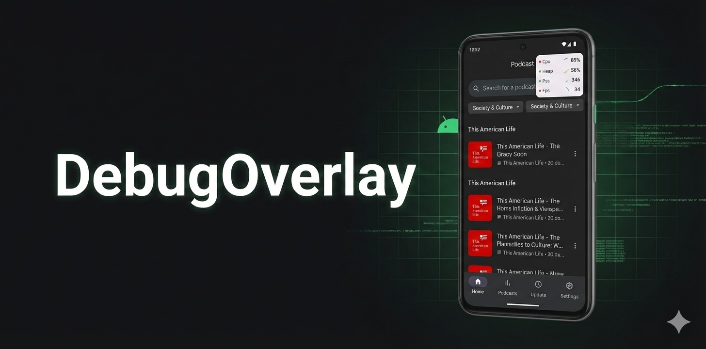
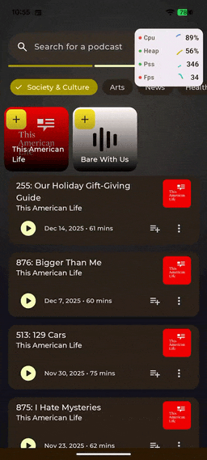
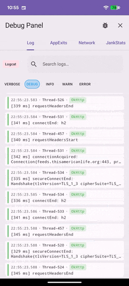
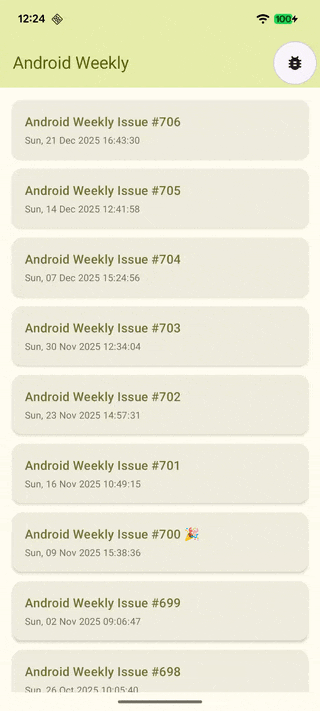
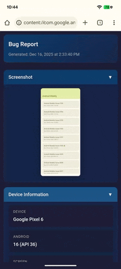
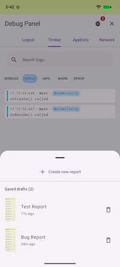
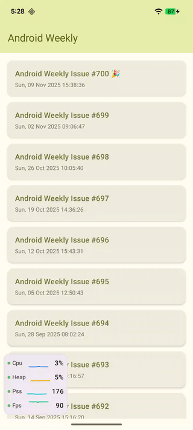

<div align="center">
  
  <br><br>
  <a href="https://central.sonatype.com/artifact/com.ms-square/debugoverlay"></a>
  <a href="https://github.com/Manabu-GT/DebugOverlay-Android/actions/workflows/android-ci.yml"></a>
  <a href="https://developer.android.com/tools/releases/platforms#7.0"></a>
  <a href="https://kotlinlang.org"></a>
  <a href="https://developer.android.com/develop/ui/compose/bom/bom-mapping"></a>
  <a href="https://www.apache.org/licenses/LICENSE-2.0"></a>
  <a href="https://github.com/Manabu-GT/DebugOverlay-Android/stargazers"></a>
  <a href="https://appetize.io/app/b_vehgnd6u6w4l7xvzixicd64fni?device=pixel7&osVersion=15.0&toolbar=true"></a>
  <br><br>
</div>

**Zero-configuration runtime diagnostics for debug/internal builds—available instantly when you need it.**

DebugOverlay gives you a lightweight, always-available look into your app's runtime state so you can spot regressions *before* you reach for heavy profilers. Use it during development, QA testing, CI runs, or customer repro investigations.

**What makes it different:**
- **Proactive** – Catch issues while developing, not after a QA report
- **Self-contained** – No companion app, no adb, no cloud account
- **No special permissions** – No `SYSTEM_ALERT_WINDOW` required
- **Developer-first** – Low-friction access to runtime state

> **Not a replacement for:** Deep profiling (Android Profiler), leak detection (LeakCanary), or crash reporting (Crashlytics). DebugOverlay is your **"check engine light"**—it tells you *when* to look deeper.

## Quick Start

```kotlin
// app/build.gradle.kts
debugImplementation("com.ms-square:debugoverlay:2.6.2")

// That's it! Overlay appears automatically on app launch.
// Tap to open debug panel. Long-press to drag.
```



## Features

### Overlay Metrics
Draggable overlay with real-time metrics and sparklines:
- **CPU** – App CPU usage from `/proc/self/stat`
- **Heap** – JVM heap usage percentage
- **PSS** – Proportional Set Size in MB
- **FPS** – Real-time frame rate
- **Thermal** – *(optional, Android 11+)* Device thermal status — enable via `OverlayMode.FullMetrics(showThermal = true)`

### Debug Panel
Tap the overlay to open a full-screen diagnostic panel:

- **Logcat** – Live system logcat stream with level filtering and search
- **[Custom Log]** – Additional tab when using [Timber](#timber-log-capture) or custom log sources
- **AppExits** – App exit (e.g., Crash/ANR) history on Android 11+ with stack traces
- **Network** – Request list with timing and inspection ([setup required](#network-request-tracking))
- **JankStats** – Frame timing analysis and jank breakdown
- **UI** – View hierarchy via [Radiography](https://github.com/square/radiography)
- **Device** – Hardware specs, OS info, battery, network status
- **Bug Report** – One-tap HTML report with screenshot and diagnostics
- **Clear Logs** – Toolbar button to wipe Logcat/Timber/network entries so the next bug report covers only the repro window



## Installation

**Requirements:** Android 7.0+ (API 24). Pure Java/XML apps work fine—no Compose setup needed in your app.

**ProGuard/R8:** No additional rules required. Works with R8 out of the box.

### Using Version Catalog

Add to `gradle/libs.versions.toml`:

```toml
[versions]
debugoverlay = "2.6.2"

[libraries]
debugoverlay = { module = "com.ms-square:debugoverlay", version.ref = "debugoverlay" }
debugoverlay-okhttp = { module = "com.ms-square:debugoverlay-extension-okhttp", version.ref = "debugoverlay" }
debugoverlay-timber = { module = "com.ms-square:debugoverlay-extension-timber", version.ref = "debugoverlay" }
debugoverlay-trigger-shake = { module = "com.ms-square:debugoverlay-extension-trigger-shake", version.ref = "debugoverlay" }
```

Then in `app/build.gradle.kts`:

```kotlin
dependencies {
  debugImplementation(libs.debugoverlay)
  // Optional extensions
  debugImplementation(libs.debugoverlay.okhttp)
  debugImplementation(libs.debugoverlay.timber)
  debugImplementation(libs.debugoverlay.trigger.shake)
}
```

### Using Kotlin DSL

```kotlin
// app/build.gradle.kts
dependencies {
  debugImplementation("com.ms-square:debugoverlay:2.6.2")
}
```

## Usage

### Auto-install

The overlay installs automatically via AndroidX Startup. No code required—just add the dependency.

> **Note:** Manual lifecycle control is not supported at the moment.

### Overlay modes

By default DebugOverlay shows the real-time metrics overlay (`OverlayMode.FullMetrics`). For QA/internal builds, you can show only the Bug Reporter FAB:

```kotlin
class MyApp : Application() {
  override fun onCreate() {
    super.onCreate()

    DebugOverlay.configure {
      overlayMode = OverlayMode.BugReporterOnly
    }
  }
}
```



### Headless mode (no on-screen overlay)

Use `OverlayMode.Hidden` to suppress the on-screen overlay entirely and trigger the panel from your own UI — useful when QA testing is obscured by the overlay, or when you want to wire a debug menu, notification action, or shake gesture as the entry point.

```kotlin
DebugOverlay.configure {
  overlayMode = OverlayMode.Hidden(
    customTabs = listOf(/* optional custom tabs */)
  )
}

// From your debug menu, notification action, etc.
Button(onClick = { DebugOverlay.openPanel(context) }) {
  Text("Open debug panel")
}
```

`DebugOverlay.openPanel(context)` works in any mode, not just `Hidden` — call it from anywhere you'd like to launch the panel programmatically.

#### Shake to open

For a zero-config shake trigger, add the shake extension:

```kotlin
dependencies {
  debugImplementation("com.ms-square:debugoverlay:2.6.2")
  debugImplementation("com.ms-square:debugoverlay-extension-trigger-shake:2.6.2")
}
```

Auto-installs via AndroidX Startup — shake the device to open the debug panel. Listening only happens while the app is foregrounded; the accelerometer is unregistered on background.

Heads-up: shake gestures might be claimed by other dev tools as well. Only add this dependency if you don't have a competing handler.

To disable auto-install, remove `ShakeTriggerInitializer` via manifest merger using the same pattern shown for the [Timber extension below](#timber-log-capture) (replace the `android:name` with `com.ms.square.debugoverlay.extension.trigger.shake.ShakeTriggerInitializer`).

### Custom tabs

Add app-specific tabs to the debug panel. Custom tabs appear after the built-in tabs:

```kotlin
DebugOverlay.configure {
  overlayMode = OverlayMode.FullMetrics(
    customTabs = listOf(
      DebugTab(title = "Feature Flags") { FeatureFlagsContent() }
    )
  )
}
```

### Thermal status

Opt in to a thermal-status row in the compact overlay:

```kotlin
DebugOverlay.configure {
  overlayMode = OverlayMode.FullMetrics(showThermal = true)
}
```

The row shows the current thermal-throttling level with a color-coded dot. Labels are abbreviated to fit the compact panel — `None` / `Light` / `Mod` / `Sev` / `Crit` / `Emer` / `Shut` — mapping to `PowerManager.THERMAL_STATUS_NONE` / `_LIGHT` / `_MODERATE` / `_SEVERE` / `_CRITICAL` / `_EMERGENCY` / `_SHUTDOWN` respectively. Requires Android 11 (API 30) or above with a working thermal HAL — the row stays hidden on older devices and on API 30+ devices whose HAL doesn't expose `getThermalHeadroom` data. If the HAL later starts reporting, the row appears on the next poll.

### Logcat buffer size

The built-in Logcat tab keeps the last 300 entries by default. Override via `maxLogcatEntries`:

```kotlin
DebugOverlay.configure {
  maxLogcatEntries = 1000
}
```

The value also bounds the `logcat -T N` / `-t N` calls, so it caps how many lines the OS replays when the panel opens and when a bug report snapshot is captured.

### Network request tracking

```kotlin
dependencies {
  debugImplementation("com.ms-square:debugoverlay:2.6.2")
  debugImplementation("com.ms-square:debugoverlay-extension-okhttp:2.6.2")
}
```

```kotlin
val client = OkHttpClient.Builder()
  .addNetworkInterceptor(DebugOverlayNetworkInterceptor())
  .build()
```

By default it redacts common auth headers and query params. To customize redaction and body size limits:

```kotlin
import com.ms.square.debugoverlay.extension.okhttp.DEFAULT_HEADERS_REDACT
import com.ms.square.debugoverlay.extension.okhttp.DEFAULT_QUERY_PARAMS_REDACT

val client = OkHttpClient.Builder()
  .addNetworkInterceptor(
    DebugOverlayNetworkInterceptor(
      headersNameToRedact = DEFAULT_HEADERS_REDACT + setOf("x-my-custom-token"),
      queryParamsNameToRedact = DEFAULT_QUERY_PARAMS_REDACT + setOf("sessionId"),
      maxBodySize = 128 * 1024L, // 128KB (use 0L to omit all bodies)
    )
  )
  .build()
```

### Timber log capture

```kotlin
dependencies {
  debugImplementation("com.ms-square:debugoverlay:2.6.2")
  debugImplementation("com.ms-square:debugoverlay-extension-timber:2.6.2")
}
```

Auto-plants via AndroidX Startup. Adds a separate "Timber" tab alongside Logcat with full stack traces.

To disable auto-plant, remove `TimberTreeStartupInitializer` via manifest merger:

```xml
<manifest xmlns:android="http://schemas.android.com/apk/res/android"
    xmlns:tools="http://schemas.android.com/tools">
  <application>
    <provider
      android:name="androidx.startup.InitializationProvider"
      android:authorities="${applicationId}.androidx-startup"
      tools:node="merge">
      <meta-data
        android:name="com.ms.square.debugoverlay.extension.timber.TimberTreeStartupInitializer"
        tools:node="remove" />
    </provider>
  </application>
</manifest>
```

Then call `Timber.plant(DebugOverlayTimberTree())` manually.

### Bug Reporting

In `OverlayMode.FullMetrics`, tap the bug icon in the debug panel toolbar. In `OverlayMode.BugReporterOnly`, tap the bug reporter FAB. Generates a ZIP with:
- Interactive HTML dashboard
- Embedded screenshot
- Logs (Logcat/Timber)
- Network history (requires OkHttp extension)
- JankStats
- App exit history (Android 11+)
- UI hierarchy
- Device info

If you dismiss the metadata dialog instead of submitting, DebugOverlay saves the capture as a **draft** (stored in internal storage, excluded from backups). Next time you open Bug Report, you can resume or delete saved drafts.

> **Privacy:** Reports contain raw logs and network data. Review before sharing externally. The OkHttp extension supports header redaction and body size limits to minimize sensitive data capture.




### Custom data in bug reports

Add app-specific diagnostic data (preferences, feature flags, etc.) to bug reports:

```kotlin
class MyApp : Application() {
  override fun onCreate() {
    super.onCreate()

    // Class-based contributor
    DebugOverlay.addBugReportContributor(UserPreferencesContributor(applicationContext))

    // Lambda-based for simple cases
    DebugOverlay.addBugReportContributor(
      BugReportDataContributor("build_info.txt") { out ->
        out.write("version=${BuildConfig.VERSION_NAME}\n".toByteArray())
        out.write("code=${BuildConfig.VERSION_CODE}\n".toByteArray())
      }
    )
  }
}

class UserPreferencesContributor(
  private val context: Context
) : BugReportDataContributor {
  override val filename = "preferences.txt"

  override fun writeTo(outputStream: OutputStream) {
    PrintWriter(outputStream).use { writer ->
      context.getSharedPreferences("settings", MODE_PRIVATE)
        .all
        .filterNot { it.key.contains("token", ignoreCase = true) } // Filter sensitive data
        .forEach { (key, value) -> writer.println("$key = $value") }
    }
  }
}
```

Custom files appear in the bug report ZIP with a `custom_` prefix (e.g., `custom_preferences.txt`).

> **Note:** Contributors have a 5-second timeout. Use Application context to avoid memory leaks.

### Custom bug report exporter

By default, bug reports open the Android share sheet. Implement `BugReportExporter` to send reports directly to Jira, Slack, or other systems:

```kotlin
class MyExporter : BugReportExporter {
  override suspend fun export(context: Context, report: BugReport): ExportResult {
    // report.summary: title, description, appInfo, deviceInfo, capturedAt
    // report.archive: fileName, sizeBytes, openInputStream()
    return ExportResult.Success
  }
}

// Register in Application.onCreate()
DebugOverlay.configure {
  bugReportExporter = MyExporter()
}
```

## Advanced Setup

### Release builds with overlay

Test R8-optimized builds while keeping diagnostics:

```kotlin
android {
  buildTypes {
    create("releaseWithOverlay") {
      initWith(getByName("release"))
      matchingFallbacks += "release"
      applicationIdSuffix = ".internal"
    }
  }
}

dependencies {
  "releaseWithOverlayImplementation"("com.ms-square:debugoverlay:2.6.2")
}
```

```bash
./gradlew installReleaseWithOverlay
```

## Sample App

```shell
./gradlew :sample:assembleDebug
```

The sample app includes a `releaseWithOverlay` build type (see [Advanced Setup](#release-builds-with-overlay)) for including DebugOverlay in an internal release build:

```shell
./gradlew :sample:installReleaseWithOverlay
```



## Changelog

See [CHANGELOG.md](CHANGELOG.md) for release history.

## License

[Apache License 2.0](LICENSE)
