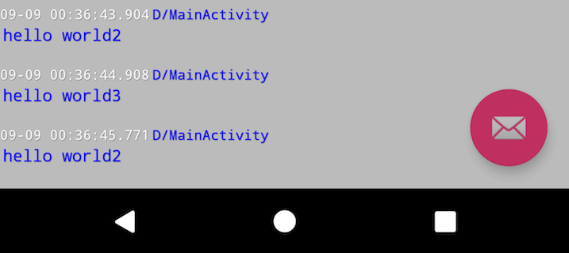

Timber Extension Module
===========

**TimberModule** is an extension module for DebugOverlay which shows timber logs for debugging.



Setup
------

Gradle:

```groovy
dependencies {
  debugImplementation 'com.ms-square:debugoverlay:1.1.4'
  releaseImplementation 'com.ms-square:debugoverlay-no-op:1.1.4'
  testImplementation 'com.ms-square:debugoverlay-no-op:1.1.4'

  implementation ('com.ms-square:debugoverlay-ext-timber:1.1.4') {
    exclude module: 'debugoverlay'
  }
}
```

or

```groovy
dependencies {
  // this will use a full debugoverlay lib even in the test/release build
  implementation 'com.ms-square:debugoverlay-ext-timber:1.1.4'
}
```

Usage
------

### Simple Example

In your `Application` class:

```java
public class ExampleApplication extends Application {

  @Override public void onCreate() {
    super.onCreate();
    new DebugOverlay.Builder(this)
            .modules(new CpuUsageModule(),
                     new MemInfoModule(this),
                     new FpsModule(),
                     new TimberModule(BuildConfig.DEBUG))
            .build()
            .install();
    // Normal app init code...
  }
}
```
